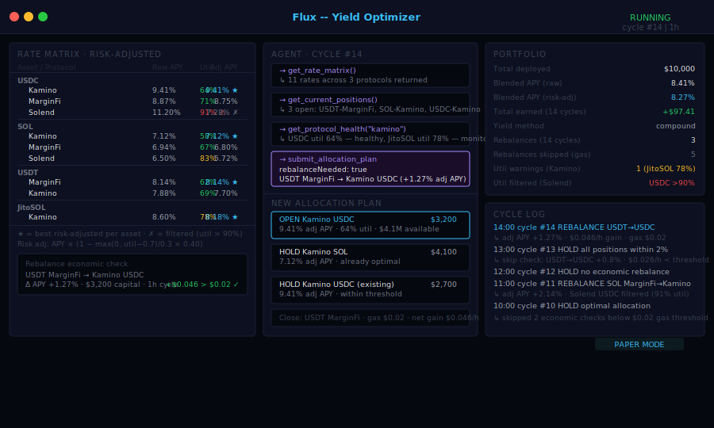
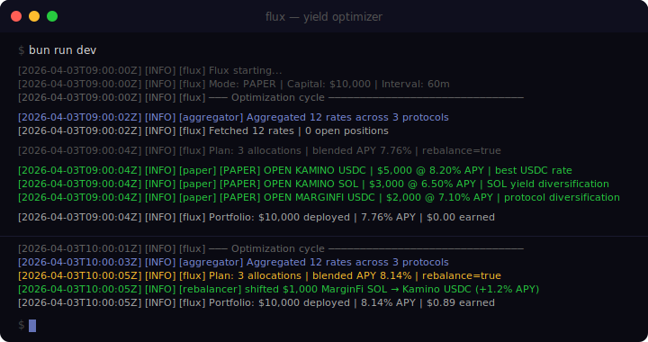

<div align="center">

# Flux

**Autonomous yield optimizer for Solana DeFi.**
Polls Kamino, MarginFi, and Solend every hour. Reasons with Claude. Rebalances when it's worth it.

[](https://github.com/FluxYield/FluxYield/actions)

[](https://docs.anthropic.com/en/docs/agents-and-tools/claude-agent-sdk)
[](https://www.typescriptlang.org/)

</div>

---

Yield farming manually means checking three dashboards, doing the math on gas costs, and second-guessing yourself at 2am.

`Flux` fetches live rates across every major Solana lending protocol, builds a rate matrix, and asks Claude to reason about the optimal allocation — factoring in utilization risk, liquidity depth, and concentration limits. It only rebalances when the improvement is meaningful. Otherwise it holds.

```
FETCH RATES → BUILD MATRIX → REASON → ALLOCATE → ACCRUE → REBALANCE
```

Paper mode on by default. One env var flip for live capital.

---

## Dashboard



---

## Terminal Output



---

## Architecture

```
┌─────────────────────────────────────────────────────┐
│               Protocol Layer                         │
│  ┌──────────┐  ┌───────────┐  ┌──────────┐         │
│  │  Kamino  │  │  MarginFi │  │  Solend  │         │
│  └────┬─────┘  └─────┬─────┘  └────┬─────┘         │
│       └──────────────┼──────────────┘               │
└──────────────────────┼──────────────────────────────┘
                       ▼
┌─────────────────────────────────────────────────────┐
│               Aggregator                             │
│   Rate matrix · Best-per-asset · Health check       │
└──────────────────────┬──────────────────────────────┘
                       ▼
┌─────────────────────────────────────────────────────┐
│            Claude Agent Loop                         │
│   get_rate_matrix → get_current_positions           │
│   → get_protocol_health → submit_allocation_plan    │
└──────────────────────┬──────────────────────────────┘
                       ▼
┌─────────────────────────────────────────────────────┐
│              Rebalancer                              │
│   Diff current vs plan · Build actions              │
│   Paper execute · Yield accrual                     │
└─────────────────────────────────────────────────────┘
```

---

## Optimization Rules

| Rule | Detail |
|------|--------|
| **Min APY gate** | Ignore any rate below 5% |
| **Rebalance threshold** | Only move capital if improvement > 2% APY |
| **Max protocol concentration** | 50% cap per protocol |
| **Utilization guard** | Avoid pools above 90% utilization |
| **Liquidity floor** | Minimum $10k available to exit |

---

## Supported Protocols

| Protocol | Assets | Notes |
|----------|--------|-------|
| **Kamino** | USDC, SOL, USDT, JitoSOL | Highest rates, most liquid |
| **MarginFi** | USDC, SOL, USDT | Good depth, lower utilization |
| **Solend** | USDC, SOL, USDT, BTC | Longest track record |
| **Drift** | USDC, SOL | Perp funding rates (opt-in) |

---

## Quick Start

```bash
git clone https://github.com/FluxYield/FluxYield
cd FluxYield && bun install
cp .env.example .env
bun run dev
```

---

## Configuration

```bash
ANTHROPIC_API_KEY=sk-ant-...
HELIUS_API_KEY=...
PAPER_MODE=true
TOTAL_CAPITAL_USD=10000
CYCLE_INTERVAL_MS=3600000   # 1 hour
MIN_APY_THRESHOLD=0.05
REBALANCE_THRESHOLD=0.02
MAX_PROTOCOL_ALLOCATION_PCT=0.50
```

---

## License

MIT

---

*money finds its own level.*
